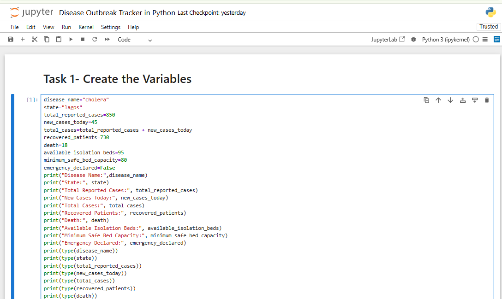

#  Disease Outbreak Tracker

A beginner-friendly Python case study that analyses disease outbreak data and generates a simple outbreak assessment report based on reported cases, recoveries, deaths, hospital capacity, and predefined outbreak conditions.

This project was developed as part of my Python learning journey and demonstrates how basic Python programming concepts can be applied to a real-world public health scenario.

---

##  Project Overview

Disease surveillance involves monitoring disease cases, recoveries, deaths, and available healthcare resources to understand the severity of an outbreak.

In this case study, I created a simple **Disease Outbreak Tracker** using Python. The project analyses outbreak information from different locations and uses calculations and logical conditions to determine:

- The total number of cases
- The number of active cases
- The recovery rate
- Whether hospital capacity is sufficient
- Whether an outbreak is severe
- Whether an emergency response is needed
- Whether the overall situation is stable

The project compares outbreak conditions between **Lagos State** and **Kano State** using sample data.

---

##  Project Objectives

The objectives of this case study were to:

- Practise creating and assigning Python variables.
- Work with different Python data types.
- Perform arithmetic calculations.
- Calculate active disease cases.
- Calculate recovery rates.
- Update values using assignment operators.
- Use comparison operators.
- Apply logical operators such as `and`, `or`, and `not`.
- Generate a structured outbreak report.
- Compare outbreak situations between different locations.

---

##  Technologies Used

- **Python 3**
- **Jupyter Notebook**

### Python Concepts Applied

- Variables
- Strings
- Integers
- Boolean values
- Arithmetic operators
- Assignment operators
- Comparison operators
- Logical operators
- `print()` function
- `type()` function
- Conditional Boolean expressions

---

##  Project Workflow

The project follows a simple outbreak analysis workflow:

```text
Input Outbreak Data
        ↓
Calculate Total Cases
        ↓
Calculate Active Cases
        ↓
Calculate Recovery Rate
        ↓
Update Case Numbers
        ↓
Check Hospital Capacity
        ↓
Assess Outbreak Severity
        ↓
Determine Emergency Response
        ↓
Assess Situation Stability
        ↓
Generate Outbreak Report
'''

---

###  Creating the Outbreak Variables

The first stage involved creating variables to store important disease outbreak information.

**The variables included:**

- Disease name
- State
- Total reported cases
- New cases
- Recovered patients
- Deaths
- Available isolation beds
- Minimum safe bed capacity
- Emergency declaration status



---

###  Calculating Active Cases
Active cases represent patients who have not yet recovered and are not included in the number of recorded deaths.
This calculation demonstrates the use of arithmetic operators in Python.


---

###  Calculating the Recovery Rate

This calculation provides an overview of the proportion of reported cases that have recovered.


---

### Updating the Total Number of Cases

The += operator allows a value to be added to an existing variable.
This is useful in outbreak tracking scenarios where new cases are continuously added to the total number of cases.


---

### Checking Hospital Capacity

The comparison operator > checks whether the available beds are greater than the minimum required capacity.


---

### Determining Whether the Outbreak Is Severe

This subsection uses logical conditions to classify the outbreak based on predefined thresholds for active cases and deaths.
The or logical operator returns True when at least one of the conditions is satisfied.


---

### Determining Whether an Emergency Response Is Needed

This subsection demonstrates how multiple Boolean conditions can be combined to determine whether additional emergency action may be required according to the project's rules.


---

### Determining Whether the Situation Is Stable

This subsection combines recovery performance and healthcare capacity to produce an overall stability assessment.
The and operator requires both conditions to be True before the overall result becomes True.


---

###  Generating the Outbreak Report

This subsection brings together the calculations and Boolean assessments to generate a single, readable outbreak summary.


